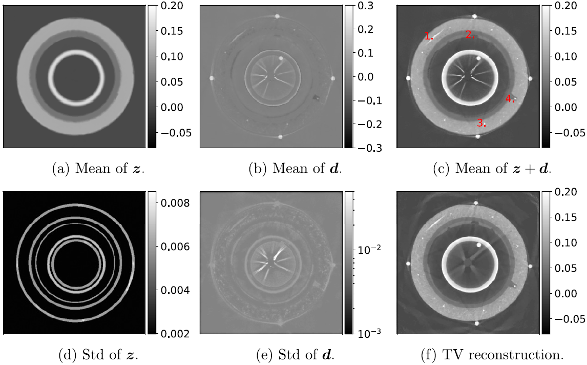
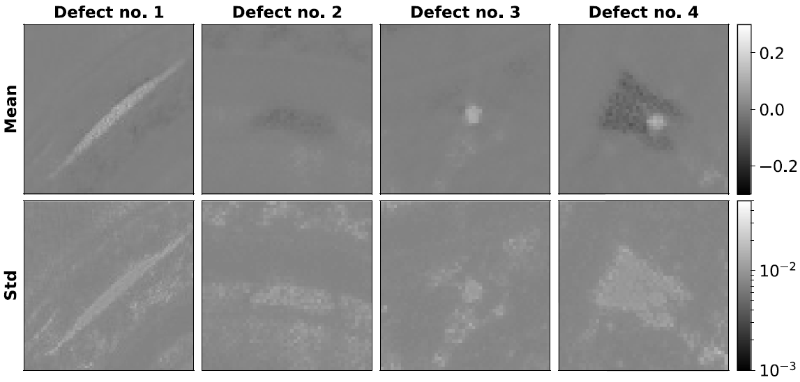

# ⚠️ Prior modeling and uncertainty quantification in X-ray computed tomography with application to defect detection in subsea pipes

> ⚠️ **Contents to be added:** Add a paragraph or so describing Silja's PhD work and publications related to subsea pipe defect detection using CUQIpy. Also add references to these resources. Possibly add a representative figure with a caption describing what it is about.

## Summary
Non-desctructive inspection of subsea pipes can be carried out using X-ray CT. The goal of such inspections is to verify the structural integrity of the pipes to avoid environmentally damaging and costly leaks. In this work, {cite}`Christensen2024`, we focus on defect detection in the pipes. With traditional CT reconstruction techniques a cross-sectional image of the pipe can be obtained given complete and high-quality data. Carrying out defect detection based on such images requires manual inspection or post-processing using for example segmentation techniques. We propose a Bayesian decomposed reconstruction framework that automatically separates the large scale structure of the pipes (circular layers of different materials) from the small defects that we are interested in detecting. In other words, defect segmentation is integrated in the reconstruction method and carried out simultaneously. Another advantage of our framework is that the Bayesian approach enables uncertainty quantification related to the reconstruction.

Our technique heavily depends on prior information about the two types of structure in the subsea pipes to separate them. For the large scale layered structure we encode information about the pipes that is generally known when the pipe manufacturing details are available: the number of layers of different materials, the attenuation properties of each layer, as well as the thickness of each layer. The prior is formulated such that the properties are an expected value but there is some room for variation. The prior representing the defects is formulated such that it promotes an image with few and small features.

Our decomposed reconstruction framework is implemented using CUQIpy. We use a wide range of CUQIpy’s features, for example:  Gaussian, Gamma, and inverse Gamma distributions from the distribution class `cuqi.distribution`, parameter mappings using `cuqi.geometry.Image2D`, a user-defined forward model based on `cuqi.model.Model`, and hierarchical modelling and Gibbs sampling using `cuqi.sampler.HybridGibbs`. Especially the user-defined forward model demonstrates the versatility of CUQIpy. Our forward problem can be defined:
\begin{equation}
y = A(z + d), 
\end{equation}
where $y$ is the noisy CT data, $A$ is the CT linear forward operator (here implemented using the third party ASTRA library {cite}`vanAarle2015`{cite}`vanAarle2016`) and $z$ and $d$ are the two unknown parameters representing images of the pipe’s large scale layered structure and the defects respectively. This is a challenging forward model to accommodate because it 1) depends on multiple parameters, and 2) depends on a different Python library. A link to the full implementation can be found in the resources section below. 

We demonstrate our proposed methodology using real data from a 2-dimensional CT scan of a subsea pipe. The figures below show that we can succesfully reconstruct the large scale layered pipe structure and the defects seperately including uncertainty estimates for each reconstruction. Our results demonstrate how prior modelling can aid defect detection in X-ray CT inspection of subsea pipes. Our framework provides a separate image of defects in the subsea pipe readily available for further analysis. Furthermore, the Bayesian approach provides uncertainty estimates related to the reconstruction of the defect image, which might aid the analysis and risk evaluation associated with the detected defects.

<figure>

<figcaption>Figure 1. (a)–(e) Posterior mean and standard deviations using real data. (f) TV reconstruction of the same data for comparison. Images of sizes 500×500 pixels.
</figcaption>
</figure>

<figure>

<figcaption>Figure 2. Zoom on posterior mean and standard deviation of the defect reconstruction. Defect numbers are defined in figure 1(c). Defect 1 images have sizes 80×80 pixels and defect 2, 3, and 4 images have sizes 50×50 pixels.
</figcaption>
</figure>

## Resources
- Paper: {cite}`Christensen2024`
- Paper code GitHub repository: https://github.com/CUQI-DTU/Paper-PipeDefectSplitting
